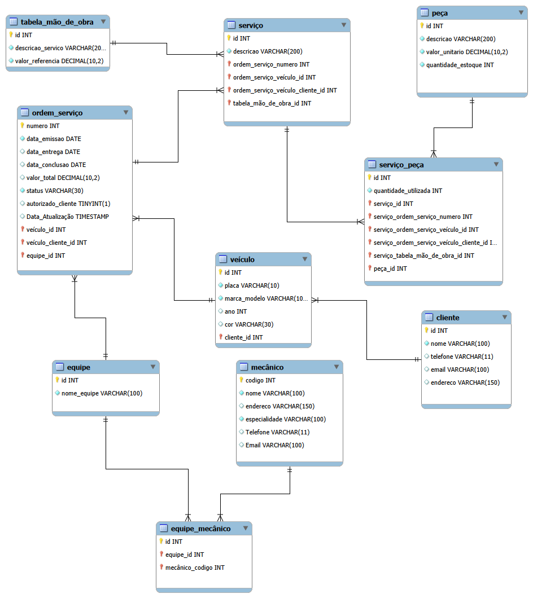

# 🔧 Oficina Mecânica – Projeto Lógico de Banco de Dados

Projeto de modelagem lógica e implementação de um banco de dados **MySQL** para o contexto de uma **oficina mecânica**: do esquema conceitual (modelo ER) ao esquema relacional, script de criação, carga de dados de teste e consultas SQL.

## 📋 Contexto

A oficina atende **clientes**, que possuem **veículos**. Para cada veículo são emitidas **ordens de serviço (OS)**, atendidas por uma **equipe** de mecânicos. Cada OS reúne vários **serviços**, cuja mão de obra é precificada por uma **tabela de referência**, e cada serviço pode consumir várias **peças** do estoque. O cliente precisa **autorizar** a OS antes da execução, e a última alteração de cada OS fica registrada.

## 🗺️ Modelo ER

O modelo conceitual foi feito no MySQL Workbench e está em [`oficina.mwb`](oficina.mwb) (imagem em [`DIAGRAMA_ER.png`](DIAGRAMA_ER.png)).



### Tabelas e atributos

| Tabela | Atributos (PK em **negrito**, FK com →) |
|---|---|
| `CLIENTE` | **id**, nome, telefone, email (único), endereco |
| `VEICULO` | **id**, placa (única), marca_modelo, ano, cor, id_cliente → CLIENTE |
| `TABELA_MAO_OBRA` | **id**, descricao_servico, valor_referencia |
| `MECANICO` | **codigo**, nome, endereco, especialidade, telefone, email (único) |
| `EQUIPE` | **id**, nome_equipe |
| `EQUIPE_MECANICO` | **id**, id_equipe → EQUIPE, codigo_mecanico → MECANICO (par único) |
| `ORDEM_SERVICO` | **numero**, data_emissao, data_entrega, data_conclusao, valor_total, status, autorizado_cliente, data_atualizacao, id_veiculo → VEICULO, id_equipe → EQUIPE |
| `SERVICO` | **id**, descricao, numero_os → ORDEM_SERVICO, id_mao_obra → TABELA_MAO_OBRA |
| `PECA` | **id**, descricao, valor_unitario, quantidade_estoque |
| `SERVICO_PECA` | **id**, quantidade_utilizada, id_servico → SERVICO, id_peca → PECA (par único) |

### Decisões de modelagem

- **Relacionamentos N:M** (equipe × mecânico e serviço × peça) viraram tabelas associativas, com restrição `UNIQUE` para impedir pares repetidos.
- **Mão de obra:** o serviço não guarda valor próprio; o valor vem de `TABELA_MAO_OBRA.valor_referencia`, evitando dados duplicados.
- **Chaves estrangeiras simples:** o diagrama do Workbench propaga chaves compostas (por exemplo, `ordem_servico_veiculo_cliente_id` em `SERVICO`). No esquema lógico foram usadas FKs simples (`numero_os`, `id_veiculo` etc.), suficientes para garantir a integridade.
- **Integridade:** `CHECK` no `status` da OS (`Aberta`, `Em Execução`, `Concluída`, `Cancelada`) e em `autorizado_cliente` (0 ou 1); `UNIQUE` em placa e e-mails; `ON DELETE RESTRICT` onde apagar o registro pai deixaria dados órfãos importantes (cliente, veículo, equipe, peça) e `CASCADE` nos itens que dependem do pai (serviços de uma OS).
- **`valor_total` da OS:** é armazenado e mantido automaticamente por uma procedure (`sp_recalcular_valor_os`) chamada por 6 triggers (inserir, alterar e remover serviços e peças). Valor = mão de obra dos serviços + (quantidade × valor unitário) das peças.
  *Limitação:* o total é recalculado quando serviços ou peças **daquela OS** mudam; alterar um preço no catálogo não atualiza sozinho as OS existentes.

## 🚀 Como executar

Requer **MySQL 8.0+** (testado na 8.0). Execute os scripts **nesta ordem**:

| Ordem | Arquivo | O que faz |
|---|---|---|
| 1 | [`01_schema.sql`](01_schema.sql) | Cria o banco `oficina_mecanica` e as 10 tabelas |
| 2 | [`02_triggers.sql`](02_triggers.sql) | Cria a procedure e os triggers do valor total |
| 3 | [`03_dados.sql`](03_dados.sql) | Insere dados de teste (o `valor_total` é calculado pelos triggers) |
| 4 | [`04_queries.sql`](04_queries.sql) | Consultas SQL, cada uma com a pergunta que responde |

```bash
mysql -u root -p < 01_schema.sql
mysql -u root -p < 02_triggers.sql
mysql -u root -p < 03_dados.sql
mysql -u root -p < 04_queries.sql
```

> No **MySQL Workbench**, abra cada arquivo e execute o script inteiro com `Ctrl+Shift+Enter`
> (`Ctrl+Enter` executa só o comando onde está o cursor).
>
> ⚠️ O `01_schema.sql` começa com `DROP DATABASE IF EXISTS oficina_mecanica`, então recria o banco do zero e apaga os dados existentes.

## 🔎 Consultas SQL

O arquivo [`04_queries.sql`](04_queries.sql) contém **28 consultas**, cada uma acompanhada da pergunta que responde. Os tópicos pedidos no desafio aparecem em mais de uma consulta.

### 1. Recuperações simples (`SELECT`)

- **1.1** Quais clientes estão cadastrados e como entrar em contato com eles?
- **1.2** Quais são os mecânicos e suas especialidades?
- **1.3** Quais serviços a oficina oferece e qual o valor de referência da mão de obra?

### 2. Filtros (`WHERE`)

- **2.1** Quais ordens de serviço ainda estão em andamento (abertas ou em execução)?
- **2.2** Quais OS estão abertas e ainda aguardam autorização do cliente?
- **2.3** Quais peças estão com estoque baixo (menos de 10 unidades)?
- **2.4** Quais OS foram emitidas entre 11 e 14 de abril de 2026?
- **2.5** Quais veículos da marca Toyota ou Honda foram fabricados a partir de 2018?

### 3. Atributos derivados (expressões)

- **3.1** Qual a idade de cada veículo?
- **3.2** Quanto custa cada peça usada em cada serviço (quantidade x valor unitário)?
- **3.3** Quantos dias levou cada OS concluída, da emissão até a conclusão?
- **3.4** Quanto cada OS custaria com 10% de desconto para pagamento à vista?
- **3.5** Quais OS não concluídas passaram da data de entrega e há quantos dias?

### 4. Ordenação (`ORDER BY`)

- **4.1** Quais são as peças mais caras? (da mais cara para a mais barata)
- **4.2** Quais são as OS de maior valor? (desempate pela data de emissão mais recente)
- **4.3** Como listar os clientes em ordem alfabética?

### 5. Filtros sobre grupos (`HAVING`)

- **5.1** Quais clientes têm mais de uma ordem de serviço?
- **5.2** Quais equipes têm mais de um mecânico?
- **5.3** Quais peças foram utilizadas em 4 unidades ou mais no total?
- **5.4** Quais serviços foram realizados mais de uma vez na oficina?
- **5.5** Quais clientes já gastaram mais de R$ 700 em OS (sem contar as canceladas)?

### 6. Junções entre tabelas (`JOIN`)

- **6.1** Qual o panorama de cada OS (cliente, veículo, equipe responsável e status)?
- **6.2** Quais serviços compõem cada OS e quanto vale a mão de obra de cada um?
- **6.3** Quais peças cada serviço utilizou? (LEFT JOIN: inclui serviços sem peças)
- **6.4** Quais mecânicos compõem cada equipe?
- **6.5** Quais peças do catálogo nunca foram utilizadas? (LEFT JOIN + IS NULL)
- **6.6** O valor_total gravado em cada OS confere com o cálculo (mão de obra + peças)?
- **6.7** Qual a receita e o ticket médio de cada equipe nas OS concluídas?

## 🛠️ Tecnologias

- MySQL 8.0
- SQL (DDL, DML, procedures, triggers)
- MySQL Workbench (modelagem ER)

## 👤 Autor

Gustavo – [@guhsilva266](https://github.com/guhsilva266)

## 📜 Licença

Distribuído sob a licença MIT – veja o arquivo [LICENSE](LICENSE).
